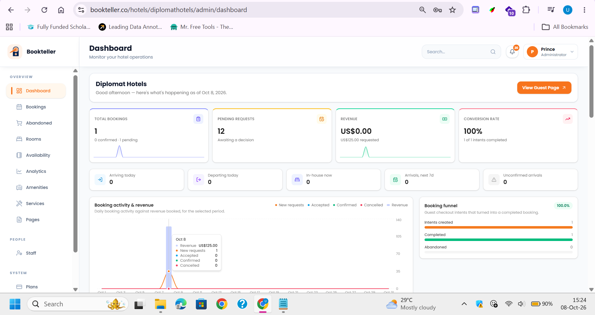
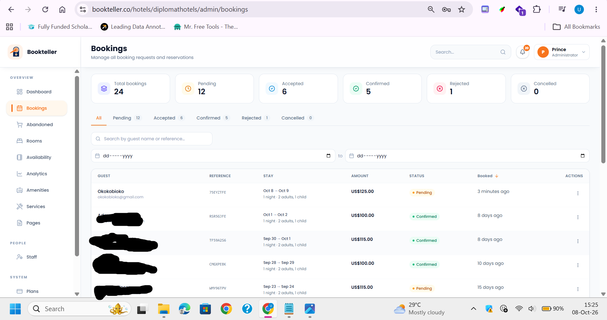
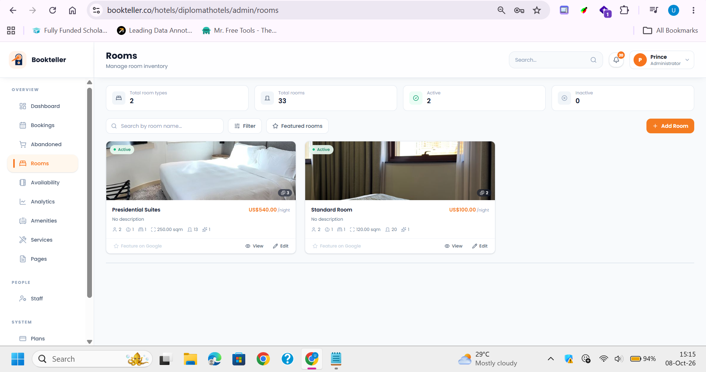
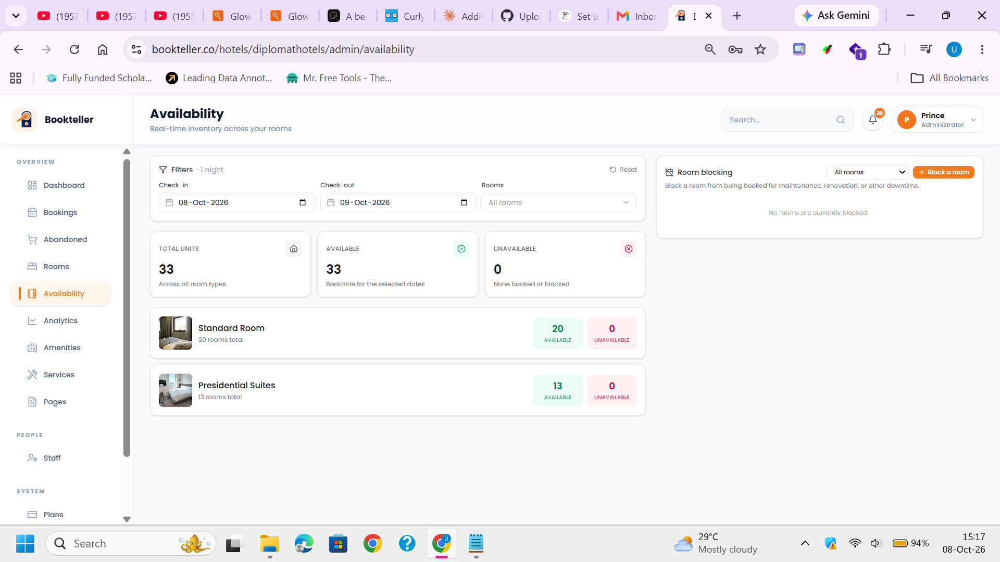
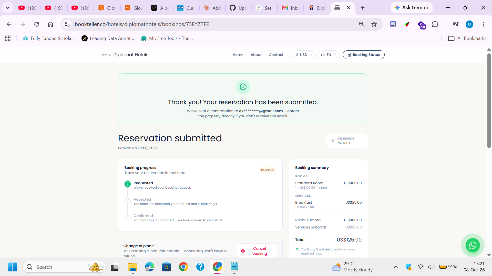
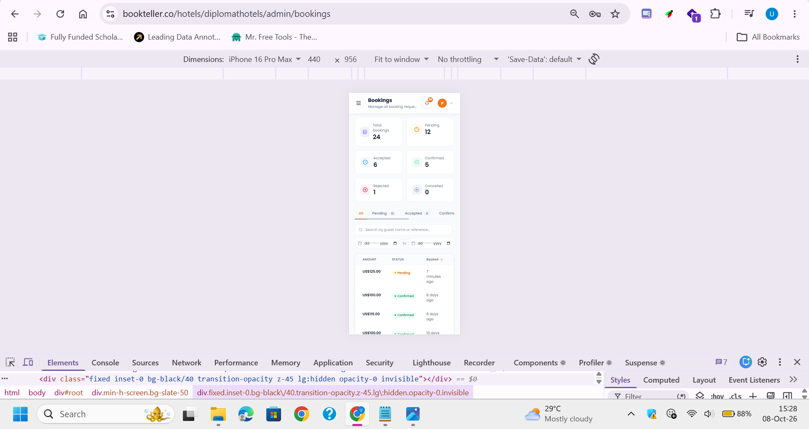

# Bookteller: Frontend Case Study

**A multi-tenant hotel management SaaS platform. I built the frontend as a freelance developer.**

🔗 **Live product:** [bookteller.co](https://bookteller.co)

|                 |                                                                                |
| --------------- | ------------------------------------------------------------------------------ |
| **Role**        | Freelance Frontend Developer                                                   |
| **Period**      | August 2026 – September 2026                                                   |
| **Stack**       | React, Tailwind CSS, TanStack Query, React Router, Axios, React Hook Form      |
| **Design**      | Implemented from Figma, plus additional pages I designed myself                |
| **Backend**     | REST API developed separately                                                  |
| **Source code** | Private (kept in the client's repository). Happy to walk through it on a call. |

---

## About the product

Bookteller lets hotels sign up, get onboarded, and run their operations from one place: bookings, rooms, amenities, services, and staff. Each hotel (tenant) gets its own admin dashboard and a guest-facing booking experience, and tenants can onboard staff who work under their account.

---

## Screenshots

### Dashboard

_Operations overview: KPI cards with trend lines, arrivals and departures counters, a booking activity and revenue chart with tooltips, and a booking funnel._

### Bookings

_Booking management with status tabs and live counts, search by guest or reference, a date range filter, and per-row actions. Guest details are blurred for privacy._

### Rooms

_Room inventory with summary stats, search and filtering, and room cards showing price per night, capacity and status._

### Availability

_Inventory across room types for selected check-in and check-out dates, with a room blocking panel._

### Guest booking reference page

_The guest-facing booking page: confirmation message, booking reference with a copy button, a progress timeline (Requested → Accepted → Confirmed), an itemized summary, and a cancellation option. The reference code is hidden for privacy._

### Responsive layout

_The same bookings page on a 440 px mobile viewport. The sidebar collapses into a menu, the stat cards reflow into a two-column grid, and the filter tabs scroll horizontally._

---

## What I built

- Frontend for the **login and signup flow, dashboard, customers, rooms, amenities, services, staff, analytics, settings, abandoned bookings, and booking reference pages**
- **Protected routes** with React Router that redirect unauthenticated users to the login page and return them to the page they originally requested after sign-in
- **Authentication state resolved at app startup**, so a session that is still being verified does not trigger a premature redirect
- **Role-based access control** for tenant and staff experiences, with authorization kept separate from authentication
- **Backend integration** with HttpOnly cookie-based sessions, using Axios for API requests and an **Axios interceptor for automatic token refresh**
- **Data fetching and caching** with TanStack Query, with loading, error and empty states across data-driven pages
- **Forms and validation** with React Hook Form
- **Responsive UI** for mobile, tablet and desktop
- **Figma to code**, plus new page designs where the Figma file did not cover a screen

---

## Engineering notes

**Authentication vs. authorization.** Authentication answers "is there a valid session?" and authorization answers "is this user allowed here?". I kept them as two separate steps. The app first resolves the session, then checks the user's role before rendering role-specific pages. This also stops users from being redirected to login while their session is still loading.

**Session handling.** The backend issues session tokens in HttpOnly cookies, so the frontend never stores sensitive tokens where scripts can read them. On the client, an Axios interceptor handles token refresh so users are not logged out unexpectedly.

**Server state.** TanStack Query handles fetching, caching and refetching, which keeps components focused on rendering. Every data view handles its loading, error and empty states.

---

## More of my work

- [Frontdesk](https://github.com/uzzylala/frontdesk): real-time customer support platform ([live demo](https://frontdesk-sigma-mocha.vercel.app/))
- [Previewly](https://github.com/uzzylala/previewly): multilingual marketing site with a headless CMS ([live demo](https://previewly-wheat.vercel.app))
- [Shiftly](https://github.com/uzzylala/shiftly): team scheduling and shift management ([live demo](https://shiftly-live-nn1g.vercel.app/login))

---

## Contact

**Uzezi Justin Onogomuho**, Frontend Developer, Warri, Nigeria

[GitHub](https://github.com/uzzylala) · [LinkedIn](https://www.linkedin.com/in/uzezi-onogomuho-84569029/)
